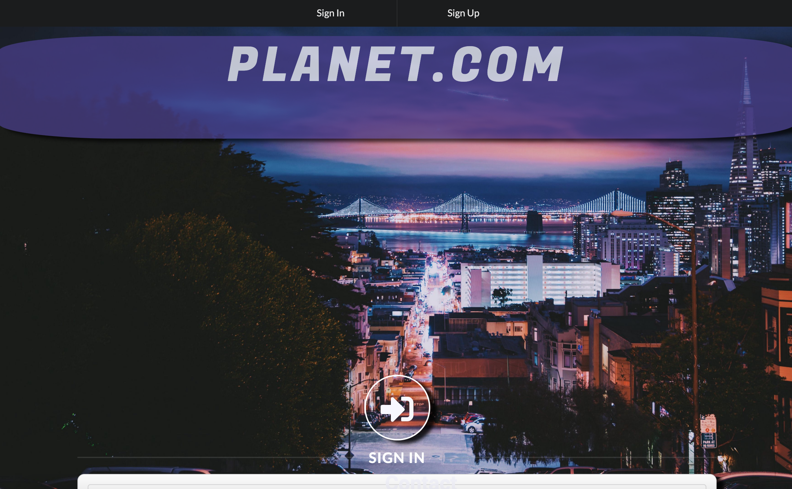
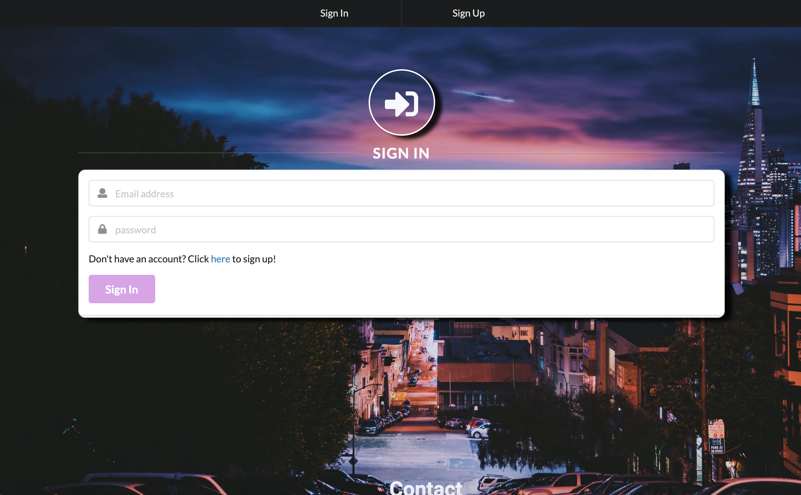
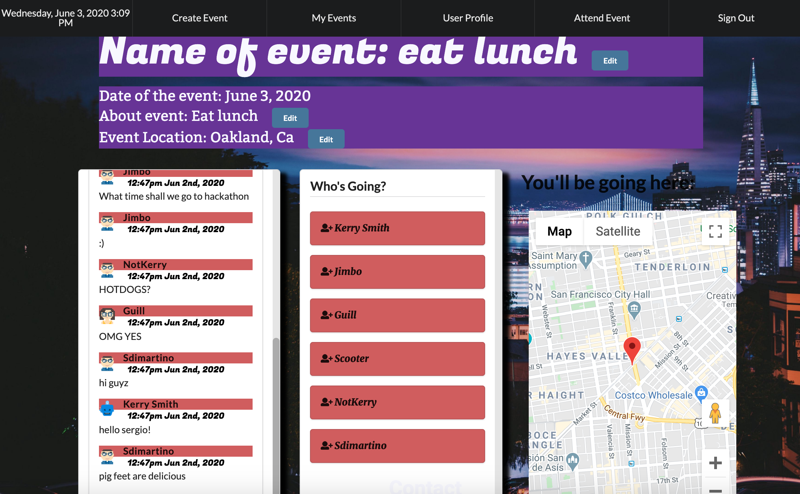

[](https://www.contributor-covenant.org/version/2/0/code_of_conduct/)

# **Planet**

# Table of Contents

- [**Planet**](#planet)
- [Table of Contents](#table-of-contents)
- [Project Description](#project-description)
- [Installation](#installation)
- [Usage](#usage)
- [Tests](#tests)
- [License](#license)
- [Contributions](#contributions)
- [Questions](#questions)
- [Developers](#developers)

# Project Description

Our project is an event planning application. Registered users can create events and track events they plan on attending. In addition, any registered user can join another user's event if they have a PIN and comment on any events they are associated with.

# Installation

The application uses the following: Mongoose, Express, React, NodeJS, bcryptjs, Google Maps React, if-env, jwt-simple, lodash, Moment.js, passport, passport-jwt, passport-local, react-geocode, and validator.

# Usage

The application is located here: [Planet](https://blooming-atoll-78659.herokuapp.com/). In order to use the application, one must sign up as a user. After signing up, the user can now create an event by clicking on the "Create Event" link in the navbar and providing details regarding the event. The user can create a PIN, which they can distribute to people they would like to invite. Once the event is created, it will be added to the user's event list, which can be accessed by clicking on the "My Events" link in the navbar. Details for each event can be seen by clicking on the "Event Details" button; clicking the "Delete" button will delete the specific event. Clicking on the "Event Details" button will take the user to the Event Dashboard. Here, a user can add a message to the message board, see who is currently going to attend the event, add tasks for the event, and view the location of the event. In addition, information regarding the event, such as the details and event location can also be edited. A user can also view their profile and join an event (if they have an event's PIN) by clicking on the "User Profile" and "Attend Event" navbar links, respectively.

# Tests

In order to run tests on this project, one may clone the respository and test it locally. Prior to running the application, the necessary packages must be installed and can be done by running the following command in the terminal while inside the project's root directory:

```sh 
npm i
```

# License

Licensed under the [MIT License](https://spdx.org/licenses/MIT.html).

# Contributions

This project is currently not accepting any contributions.

# Questions

If you have any questions, please contact the project developers by clicking on the email addresses listed below.

# Developers

Guillermo Martin  
[Github](https://github.com/Guillermo-Martin)  
<gscalica@gmail.com>

Jimmy Ngo  
[Github](https://github.com/jngo2013)  
<jngo2013@gmail.com>

Kerry Smith  
[Github](https://github.com/Kerry-Jr)  
<kerrysfs@gmail.com>

Scott Whitney  
[Github](https://github.com/scott-whitney)  
<scott.whitney334@gmail.com>



